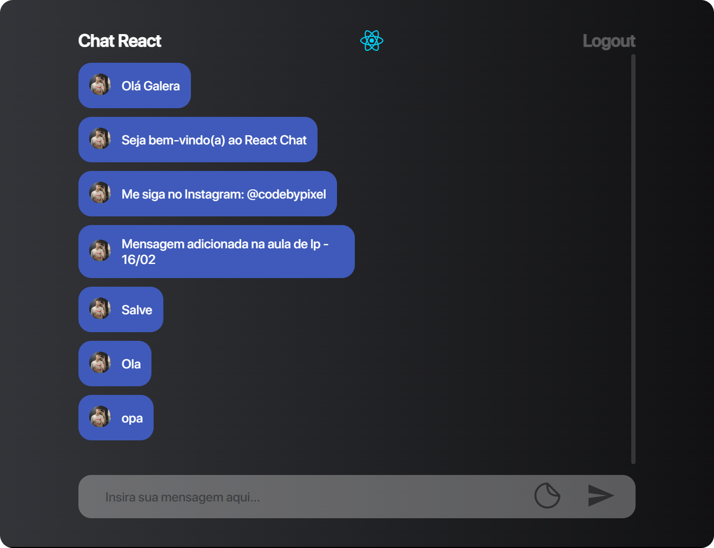

# ImersaoReact

Chat online criado durate a Imersão React (24/01/2022 - 28/01/2022) da Alura.

## Responsividade

O App foi desenvolvido para ser compatível com qualquer tamanho de tela através da responsividade. 

## Tecnologias

### React.js

O <a href="https://pt-br.reactjs.org" target="_blank">React</a> é uma tecnologia que vem em crescente no mercado dos desenvolvedores FrontEnd, ele é um framework js que facilita a construção de páginas e uma de suas principais características é a criação de componentes.

### Supabase

A <a href="https://supabase.com" target="_blank">Supabase</a> é um banco de dados alternativo e online, mesmo sendo uma ferramenta gratuita, ela apresenta muitos benefícios para o usuário, como o uso de API.
No projeto a Supabase foi usada para guardar as mensagens inseridas no chat.

### API Github

A <a href="https://api.github.com" target="_blank">API do Github</a> é uma ferramenta que permite acessarmos vários dados de algum usuário no site. No projeto a API do Github foi usada na tela de login, que consegue pegar a foto, nome, followers, following e repositories do @ digitado no input de pesquisa.

## Demo

Para testar acesse o link: 
<a href="https://ulissesjunior.github.io/ImersaoReact/" target="_blank">Imersão React</a>